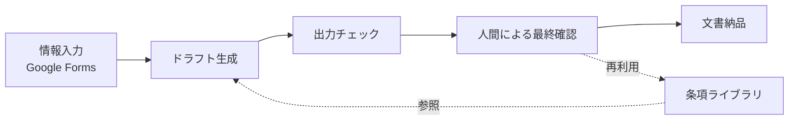

# マンダート 伊津美 — AIワークフロー設計 / 業務オペレーション

英国在住。ParalegAI Solutionsを立ち上げ、AIを活用した文書ワークフローや業務オペレーションの設計に取り組んでいます。法務・出版・物流分野での文書管理実務を土台に、Claude Codeを用いたマルチエージェント型ワークフローの設計・検証を行っています。

- 拠点：英国／稼働：フルリモート希望
- 🌐 paralegaisolutions.com　✉️ creatizpippo0704@gmail.com

商用サービスのため、プロンプトファイル・CLAUDE.md本体は非公開です。設計思想と構成を中心に紹介します。

---

## 設計思想

- 1回のプロンプトで完結させず、複数の役割に分けて設計する
- AIだけに判断させず、人による最終確認を必ず組み込む
- リスク（期限・証拠不備など）を先に洗い出してから設計する
- 法務・事務実務で培った「正確性」への意識を反映する

---

## プロジェクト①：賃貸契約文書ワークフロー設計（プロトタイプ・内部設計）

入力フォームでの情報構造化、ドラフト生成、チェック、人間確認、再利用を分離したワークフローです。

入力・生成・レビュー・再利用を分離し、品質と再利用性を重視した設計です。

---

## プロジェクト②：マルチエージェント型ドラフトパイプライン構築（プロトタイプ・内部設計）

長いプロンプト1本への依存を避け、役割ごとに品質確認ができる状態を目指した設計です。

---

## プロジェクト③：サービス導線・業務オペレーション設計

Carrd（ランディングページ）・Notion・Stripeを用い、サービス案内から決済・納品までをオンラインで完結させる導線を構築しました。

---

## Case Study：家賃滞納〜退去通知パイプライン（内部検証）

入力検証、進行状況追跡、証拠整理、人による確認、文書生成、最終監査の6役割に分解し、4件の構造化テストケースで動作を検証しました。本番運用に向けレグレッションテスト済み、実案件データでの継続検証を予定しています。

---

## 技術スタック

Claude Code、Git / GitHub、Markdown、Mermaid、Notion、Google Workspace、Google Forms

生成AIワークフロー設計、プロンプト設計

---

## 関心のあるポジション

AIワークフロー設計／AIオペレーション／業務プロセス改善／AI導入支援／Legal Operations・Document Operations
